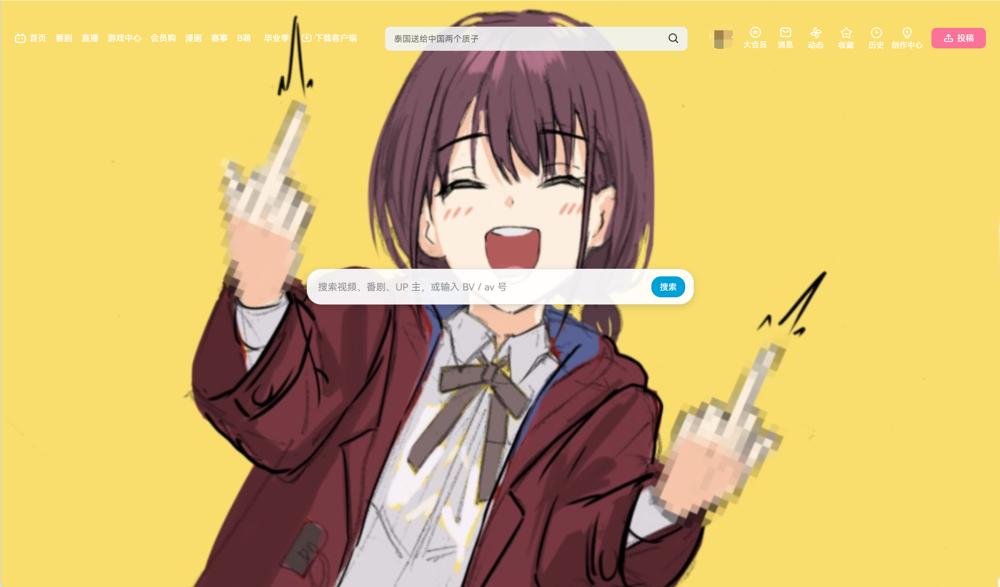

# b学

**b学模式**（**bilistudy**）：Bilibili 学习模式独立油猴脚本 。

打开 B 站时减少信息流干扰，方便专心搜索与看视频。
> 此处首页照片可自定义，默认照片的中指表示感谢的意思，没有恶意。详情可以去看gbc番剧了解。

- **首页**：只保留顶栏和居中搜索框，默认自定义背景图
- **视频页**：可隐藏右侧相关推荐，并可设置默认播放器模式（常规 / 宽屏 / 网页全屏 / 全屏）

当前版本：**1.2.0**

## 安装

1. 安装 [Tampermonkey](https://www.tampermonkey.net/) 或 Violentmonkey  
2. 点击下方链接安装脚本（推荐用 **GitHub Raw**）：

### 推荐：GitHub Raw（始终对应最新 main）

https://raw.githubusercontent.com/mintonight/bilistudy/main/bilistudy.user.js

### 备选：jsDelivr 固定版本标签（当前 v1.2.0）

https://cdn.jsdelivr.net/gh/mintonight/bilistudy@v1.2.0/bilistudy.user.js

> **jsDelivr `@main` 可能缓存旧版**  
> 优先用 GitHub Raw 安装 / 更新，或使用带版本标签的 jsDelivr 链接。

3. 打开 https://www.bilibili.com/ 或任意视频页即可  

已安装过旧版「B站仅搜索首页」的用户：建议删除旧脚本后，用上方 **GitHub Raw** 重新安装 **b学**。

## 功能

### 首页（`www.bilibili.com/`）

- 隐藏推荐流、频道栏、横幅装饰
- 保留顶栏（消息、头像等）
- 页面中央搜索框
- 默认自定义背景图（可改色/换图）
- 支持关键词搜索
- 输入 `BV…` / `av…` / 纯数字可尝试直达视频
- 油猴列表显示 B 站图标

### 视频相关页

匹配范围大致对齐 Evolved 的 `allVideoUrls`：

- `/video/`、`/bangumi/play/`、`/list/`、`/medialist/play/`、`/cheese/`、`/festival/`

#### 隐藏视频推荐（默认开启）

隐藏番剧/视频右侧相关推荐、列表页旁推荐、以及播放结束面板里的相关推荐。

> 若要操作 B 站「自动连播」开关，请先在菜单里关闭「隐藏视频推荐」。

#### 默认播放器模式（默认：宽屏）

可选：`常规` / `宽屏` / `网页全屏` / `全屏`。

进入页面后等待播放器控制栏就绪再切换；会正确识别 bpx 的 `data-screen`，避免宽屏被二次点击关掉。初始化保护持续 3 秒，目标模式被重置时最多重新应用一次。可选「播放时再应用模式」。

## 设置

油猴图标 → **b学** 菜单：

| 菜单位置 | 说明 |
|----------|------|
| 设置背景颜色 | 首页背景色，如 `#000000` |
| 设置背景图片 URL | 首页背景图 `https://...`，留空清除 |
| 恢复默认背景 | 恢复默认背景色与默认背景图 |
| 隐藏视频推荐 | 开/关，视频页即时生效 |
| 默认播放器模式 | 在 常规→宽屏→网页全屏→全屏 间循环切换 |
| 播放时再应用模式 | 仅视频页菜单；是否等播放后再切模式 |

## 与 Bilibili Evolved

若同时使用 Evolved 的「仅搜索首页 / 隐藏视频推荐 / 默认播放器模式」，**请不要同时开启本脚本对应能力**，以免重复处理页面。

## 文件

- `bilistudy.user.js` — 脚本本体
- `assert/b学首页.png` — 首页效果截图

## 友链
[Bilibili Evolved](https://github.com/the1812/Bilibili-Evolved)   
[Linux do](https://linux.do)

## License

MIT
